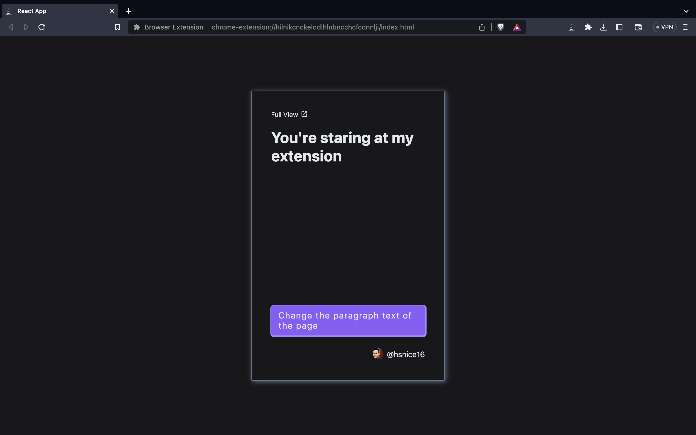

# browser-extension

an extension I built for learning, and it includes working with popup, background script and content script.

## Check In Action

- First generate a build: `npm run build`
- Now, `Load unpacked` this build on `Manage Extensions` (keep in mind that `Developer mode` should be on)

---

_check my profile on [Twitter](https://twitter.com/hsnice16)_
